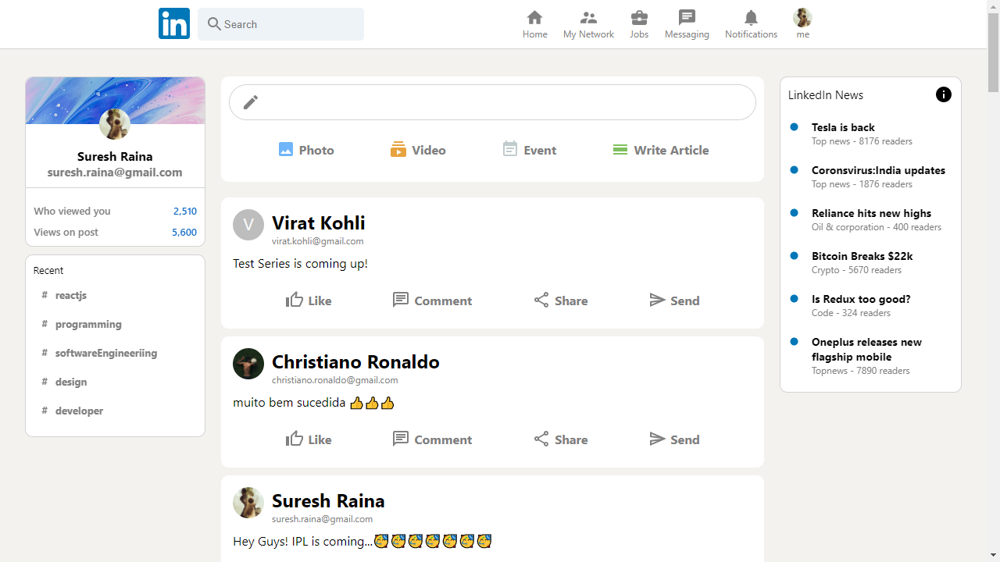

# linkedin-clone

[Demo](https://linkedin-clone-8cb27.web.app/)

### Overview of the project:

It is a <strong>linkedin-clone</strong> where i implemented the Login, Register & Post functionalities.

### Steps:

1. For registration, provide Full name, Email & Password and profile pic url is optional. Once all the details are provided simply click on Register Now.
2. Now, to send a post, type anything on the post input box and click on Enter. We can see a animation, when posting the details, we have used the react-flip-move effect for this animation.
3. For storing the post details, we have used the firestore.
4. To logout, simply click "me" option on Navbar.
5. For login, provide Email & Password and click on Sign In so that you will be logged into the app. I have used the Firebase authentication for registration & login.

Technologies used are <strong>ReactJS, CSS, Redux</strong>